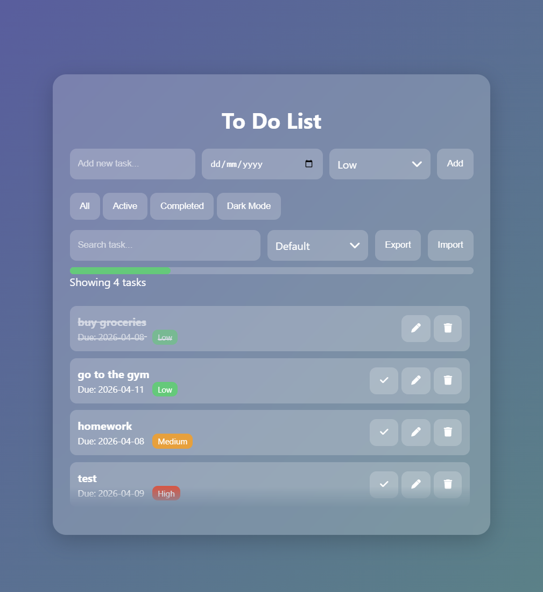
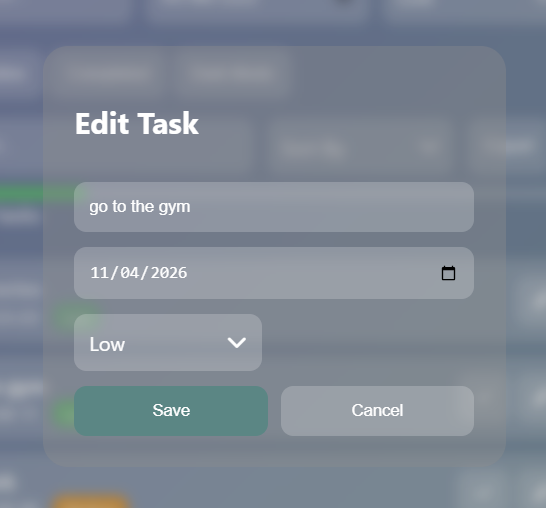
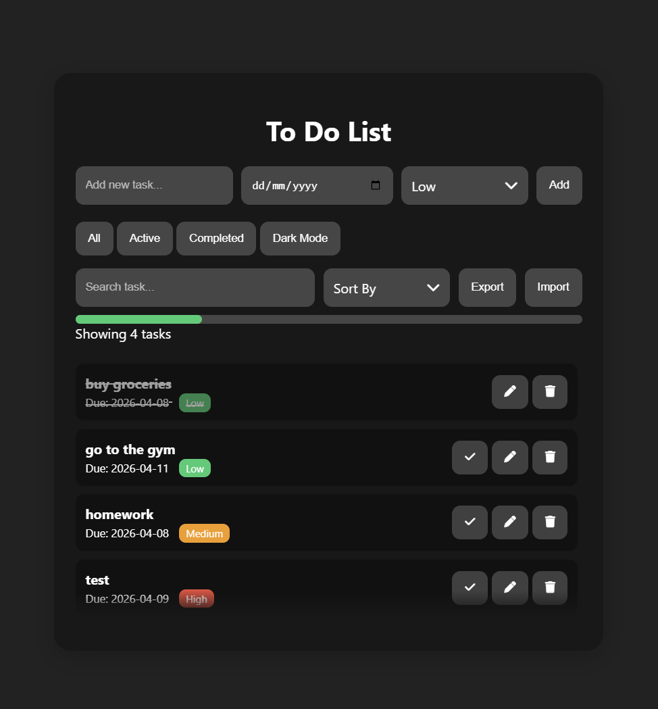

# 📝 To Do List App

A modern and interactive **To Do List Web App** built with pure **HTML, CSS, and JavaScript**.
Designed with a **glassmorphism UI**, smooth animations, and advanced features to deliver a premium user experience.

---

## ✨ Features

### 📌 Task Management

* Add, edit, delete tasks
* Mark tasks as completed
* Due date support
* Priority levels (High / Medium / Low)

### 🔍 Productivity Tools

* Search tasks in real-time
* Filter (All / Active / Completed)
* Sort by:
  * Due Date
  * Priority
* Progress bar (task completion)

### 🎨 UI / UX

* Glassmorphism design
* Dark mode toggle
* Smooth animations & micro-interactions
* Responsive (mobile & desktop)
* Custom dropdown (no default select)

### ⚡ Advanced Features

* Drag & Drop reordering
* Export tasks to JSON
* Import tasks (Replace / Merge)
* Toast notifications (glass style)
* Empty state UI (dynamic based on filter)

---

## 🖼️ Preview

### Main UI


### Edit Modal


### Dark Mode


---

## 🛠️ Tech Stack

* HTML5
* CSS3 (Glassmorphism + Animation)
* Vanilla JavaScript (No Framework)
* Local Storage API

---

## 📂 Project Structure

```
todo-list-app/
│
├── assets/
│   └── preview.png
├── index.html
├── style.css
├── script.js
└── README.md
```

---

## 🚀 How to Run

1. Download / clone this repository
2. Open `index.html` in your browser

No installation needed ✅

* Live demo link:
https://komangeliann.github.io/todo-list-app/

---


## 💾 Data Storage

* Uses **Local Storage**
* Data persists automatically in browser
* No backend required

---

## 📦 Export / Import

### Export

* Download tasks as `.json`

### Import

* Upload `.json` file
* Choose:

  * Replace existing tasks
  * Merge with current tasks

---

## 🎯 Key Highlights

* Clean and structured code
* Reusable components (dropdown, toast)
* Smooth UX with micro-interactions
* Fully client-side (fast & lightweight)

---

## 👨‍💻 Author

**I Komang Elian Triananda Kusuma**

---

## ⭐ Notes

This project is part of my portfolio to showcase:

* Frontend engineering skills
* UI/UX design thinking
* Clean code structure

---

## 🔥 Final Result

A **premium-looking, feature-rich To Do App**
built without any framework — optimized for performance and simplicity.

---
